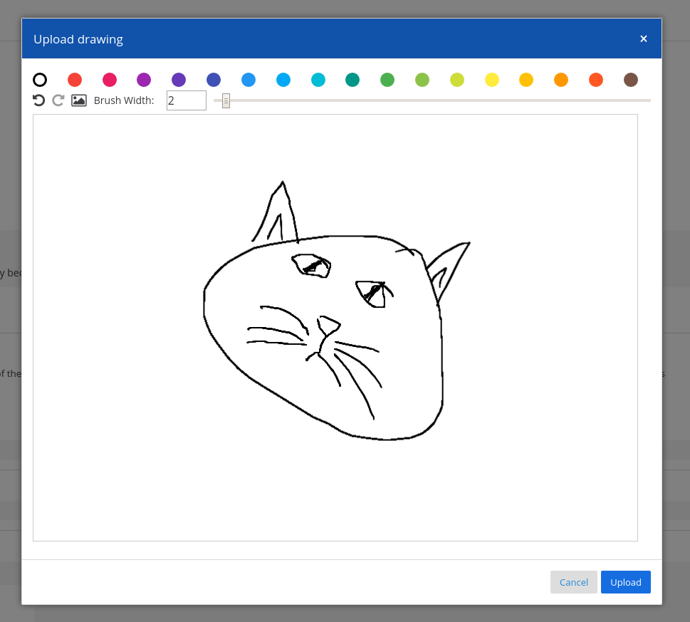

<h1 align="center">
 :paintbrush: Mattermost Draw Plugin :paintbrush:
</h1>

This plugin will allow you to draw direcly in mattermost and upload the result
as an image attachment.

Besides allow you to open local images, edit them and upload.

  

## Installation

1. Go to the [releases page of this GitHub repository](https://github.com/cpanato/mattermost-plugin-nextbus/releases) and download the latest release for your Mattermost server.
2. Upload this file in the Mattermost **System Console > Plugins > Management** page to install the plugin, and enable it. To learn more about how to upload a plugin, [see the documentation](https://docs.mattermost.com/administration/plugins.html#plugin-uploads).
3. Start using your plugin and have fun.
